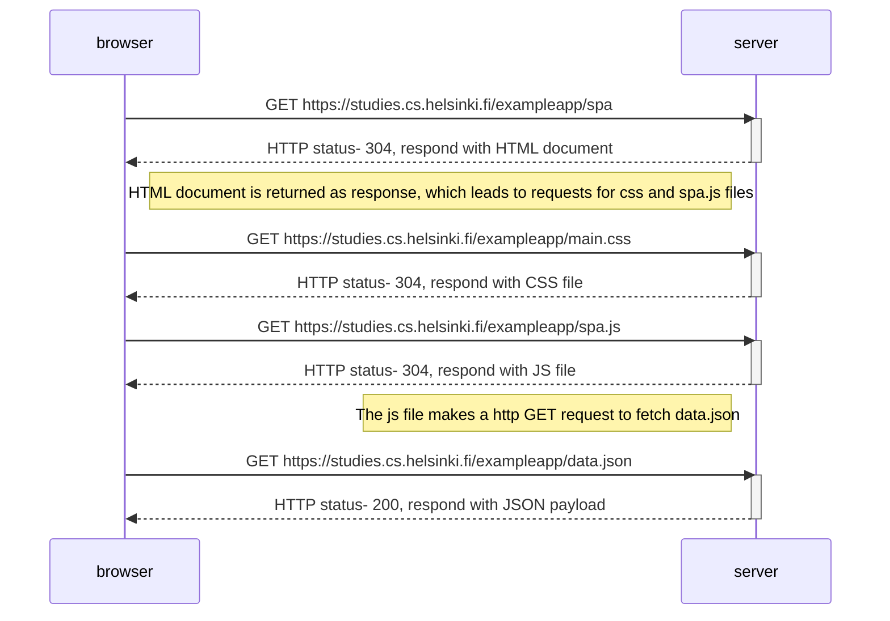

# Diagram representing initial `GET` request in _SPA_

```mermaid
sequenceDiagram
    participant browser
    participant server

    browser->>server: GET https://studies.cs.helsinki.fi/exampleapp/spa
    activate server
    server-->>browser: HTTP status- 304, respond with HTML document
    deactivate server

    Note left of server: HTML document is returned as response, which leads to requests for css and spa.js files

    browser->>server: GET https://studies.cs.helsinki.fi/exampleapp/main.css
    activate server
    server-->>browser: HTTP status- 304, respond with CSS file
    deactivate server

    browser->>server: GET  https://studies.cs.helsinki.fi/exampleapp/spa.js
    activate server
    server-->>browser: HTTP status- 304, respond with JS file
    deactivate server

    Note left of server: The js file makes a http GET request to fetch data.json

    browser->>server: GET  https://studies.cs.helsinki.fi/exampleapp/data.json
    activate server
    server-->>browser: HTTP status- 200, respond with JSON payload
    deactivate server


```
