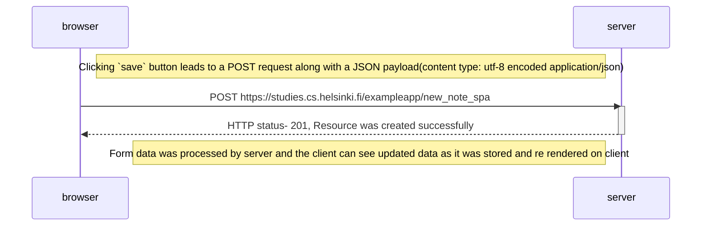

# Diagram representing `POST` request in _SPA_

```mermaid
sequenceDiagram
    participant browser
    participant server

    note right of browser: Clicking `save` button leads to a POST request along with a JSON payload(content type: utf-8 encoded application/json)

    browser->>server: POST https://studies.cs.helsinki.fi/exampleapp/new_note_spa
    activate server
    server-->>browser: HTTP status- 201, Resource was created successfully
    deactivate server

    Note left of server: Form data was processed by server and the client can see updated data as it was stored and re rendered on client

```
