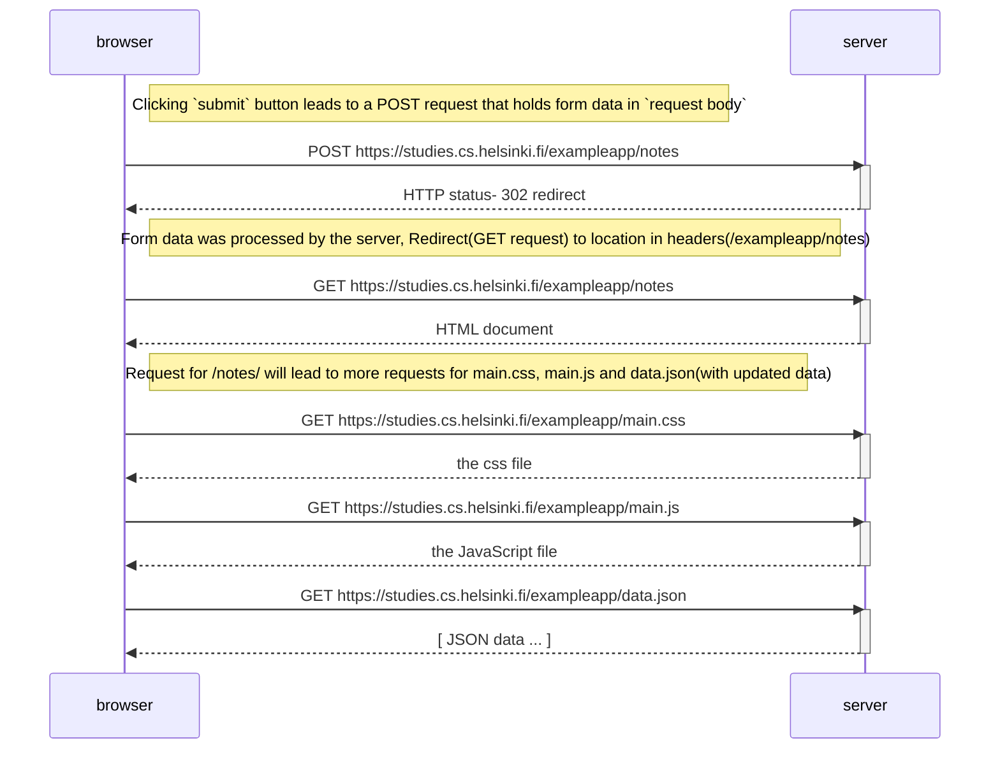

# Diagram representing `HTTP` Post request from Browser to Server

```mermaid
sequenceDiagram
    participant browser
    participant server

    note right of browser: Clicking `submit` button leads to a POST request that holds form data in `request body`

    browser->>server: POST https://studies.cs.helsinki.fi/exampleapp/notes
    activate server
    server-->>browser: HTTP status- 302 redirect
    deactivate server

    Note left of server: Form data was processed by the server, Redirect(GET request) to location in headers(/exampleapp/notes)

    browser->>server: GET https://studies.cs.helsinki.fi/exampleapp/notes
    activate server
    server-->>browser: HTML document
    deactivate server

    Note right of browser: Request for /notes/ will lead to more requests for main.css, main.js and data.json(with updated data)

    browser->>server: GET https://studies.cs.helsinki.fi/exampleapp/main.css
    activate server
    server-->>browser: the css file
    deactivate server

    browser->>server: GET https://studies.cs.helsinki.fi/exampleapp/main.js
    activate server
    server-->>browser: the JavaScript file
    deactivate server

    browser->>server: GET https://studies.cs.helsinki.fi/exampleapp/data.json
    activate server
    server-->>browser: [ JSON data ... ]
    deactivate server

```
